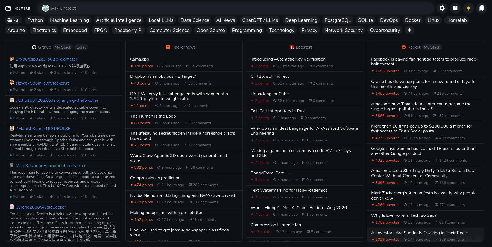

# DevTab

A private, focused developer news new tab page for Firefox. No tracking, no ads, no external backend.

<p align="center">
  
</p>

## Features

- News from GitHub, Hacker News, Lobsters, Product Hunt, Reddit, and your own RSS feeds
- Tag filters and card controls to organize feeds your way
- Bookmarks, read state, and continued-sync across sessions
- Do Not Disturb hours, dark/light theme, compact mode
- All requests go directly to each source's public API
- Open source under Apache 2.0

## Install from Firefox

[Get DevTab on Firefox Add-ons](https://addons.mozilla.org/en-US/firefox/addon/mdevtab/)

## Build from source

Requires Node >= 22. See `make help` for all tasks.

```bash
make install
make test
make package
```

The extension is packaged as `firefox_extension.zip`.

## Development

```bash
make dev
```

## License

Apache 2.0. See [LICENSE](/LICENSE).
